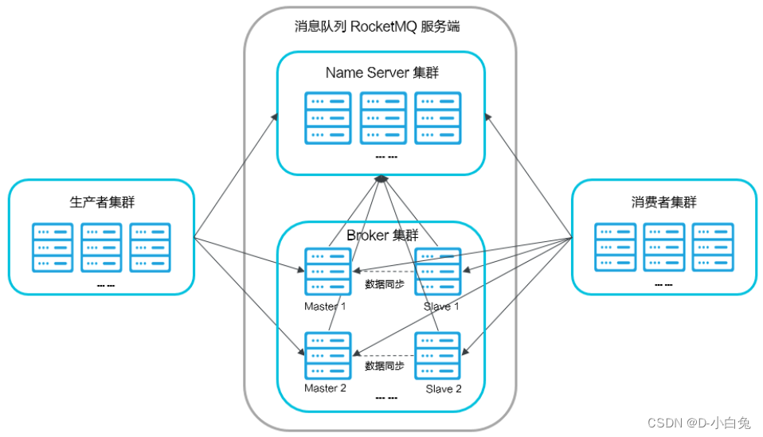

I think MQ is a genuis solution of non-real-time data requests between systems, especially in distributed systems for e-commerce, finance, big data. Here I am going to document some of my thoughts on MQ.

---

I enjoy this structure figure. It is figure of Rocket-MQ which contributed by Alibaba technology team, has stood the test of time, widely adopted by tech giants.
